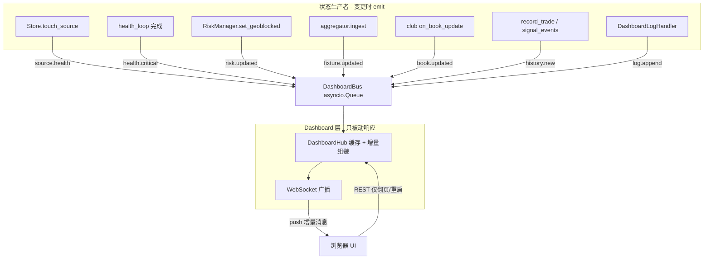
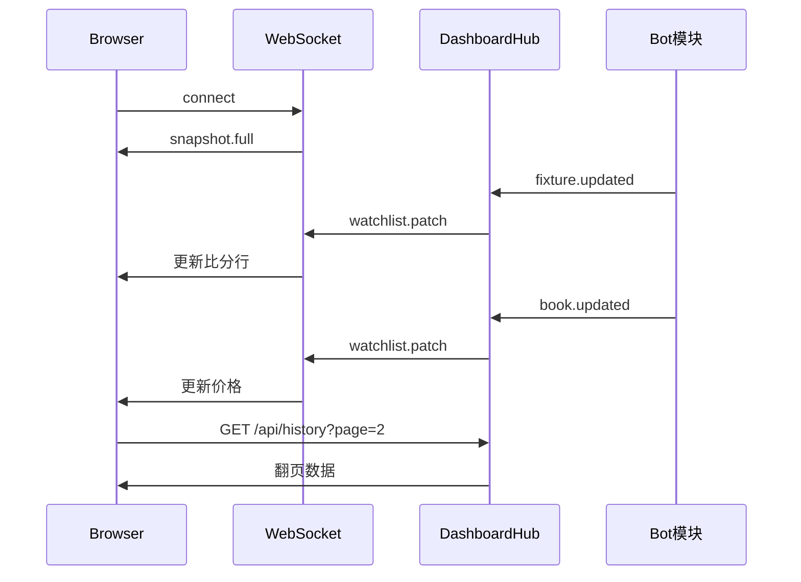

# Polymarket Bot 可视化 Dashboard

## 架构原则：事件驱动推送，禁止 Dashboard 轮询 Bot 状态

**错误模式（已废弃）：** Dashboard 定时读 `ArbApp` 内存 / 调 REST 拉状态 → 本质是 Dashboard 轮询业务模块。

**正确模式：** 业务模块在**状态发生变更的瞬间**发出事件 → `DashboardHub` 更新缓存 → WebSocket **主动推送**给浏览器。浏览器除翻页、重启外**不轮询**任何 live 接口。




## 事件类型与触发点


| 事件                  | 触发位置                                                                       | 推送内容                             |
| ------------------- | -------------------------------------------------------------------------- | -------------------------------- |
| `source.health`     | 各 provider `fetch_updates` 后 `[Store.touch_source()](src/store/sqlite.py)` | 单个数据源 `{id, ok, last_ts, error}` |
| `health.critical`   | `[health_loop](src/main.py)` 跑完 `run_health_checks`                        | gamma/clob/geoblock 检查结果         |
| `payment.api`       | live 模式下 CLOB `get_balance_allowance` 探测完成                                 | `{ok, detail}`                   |
| `risk.updated`      | `[RiskManager.set_geoblocked](src/engine/risk.py)` / `live_paused` 变化      | geoblock、pause 状态                |
| `fixture.updated`   | `[aggregator.ingest()](src/sports/aggregator.py)` 更新 `_live`               | 受影响 match_key 的比分/分钟             |
| `watchlist.armed`   | `[SignalEngine](src/engine/signals.py)` arm/disarm                         | market_id + armed 布尔             |
| `book.updated`      | `[ClobOrderbookFeed](src/pm/clob_ws.py)` `on_update` 回调                    | token_id → best_ask/size         |
| `watchlist.changed` | gamma sync 新增/关闭市场、matcher 映射                                              | 仅当 watchlist 集合变化时全量刷新当前页        |
| `history.new`       | `record_trade` / `record_signal_event`                                     | 单条成交或错过记录                        |
| `status.updated`    | bot 启动、armed 数量变化                                                          | PID、uptime、armed 数               |
| `log.append`        | 任意结构化日志写入                                                                  | 单行 JSON log                      |


**高频合并（仍是推送，不是轮询）：** `book.updated` 同一 token 200ms 内多次变更合并为一条推送，避免 WS 刷屏；合并窗口结束后立即 push。

## 四大 UI 区块

### 1. 健康检查 Health Group

**展示：** 卡片网格，绿/红/灰/黄状态点 + 最后更新时间 + 错误摘要。

**更新方式：**

- 某数据源 ping 完成 → `source.health` 事件 → **只更新该卡片**，不刷新整页
- health_loop 完成 → `health.critical` → 更新 gamma/clob/geoblock 三项
- geoblock 变化 → `risk.updated` → 顶部警告条同步

### 2. Watchlist（监听中比赛）

**数据：** SQLite watchlist + 内存 enrich（armed、比分、盘口）。

**更新方式：**

- `fixture.updated` → 更新对应行的比分/分钟（DOM patch）
- `book.updated` → 更新对应行的 Yes/No 价格
- `watchlist.armed` → 更新 armed 标记
- `watchlist.changed` → 重绘当前页（仅 watchlist 成员变化时，非定时）

**焦点卡片（日本 vs 巴西）：** 订阅 `fixture.updated` + `book.updated`，仅当焦点 market 的 fixture_key / token 匹配时推送 `focus.updated`。

**分页：** 用户点击翻页时 **唯一** 调用 `GET /api/watchlist?page&size`；平时靠 WS 增量更新当前页可见行。

### 3. 成交 / 错过记录

**持久化：** 新增 `signal_events` 表（skip / not_filled / risk_block / done_no_trade）+ 现有 `trades`。

**更新方式：**

- 新成交或错过 → `history.new` 事件 → 若用户在第 1 页， prepend 一行；否则仅更新 total 计数
- 翻页 → REST `GET /api/history?page&size`

### 4. 运行状态 + 日志 + 重启

**更新方式：**

- `risk.updated` / `status.updated` → 推送状态栏
- `log.append` → 日志面板追加一行（logging Handler 直接 emit，不等 poll）
- 重启 → `POST /api/restart`（唯一写操作）

## 后端实现

### 新增核心模块


| 文件                                                             | 职责                                                                          |
| -------------------------------------------------------------- | --------------------------------------------------------------------------- |
| `[src/dashboard/bus.py](src/dashboard/bus.py)`                 | `DashboardBus`：`emit(event_type, payload)` + async consumer                 |
| `[src/dashboard/hub.py](src/dashboard/hub.py)`                 | 订阅 bus，维护 `{health, watchlist_cache, focus, status}` 缓存，调用 `broadcast(msg)` |
| `[src/dashboard/server.py](src/dashboard/server.py)`           | FastAPI + WebSocket `/ws`；连接时发 `snapshot.full`，之后只收 push                    |
| `[src/dashboard/log_handler.py](src/dashboard/log_handler.py)` | logging Handler → `bus.emit("log.append", ...)`                             |
| `[src/dashboard/static/*](src/dashboard/static/)`              | 前端四区块 UI                                                                    |


### 挂载 emit 的修改点（在状态变更源头，而非 dashboard 轮询）


| 文件                                                     | 挂载                                                              |
| ------------------------------------------------------ | --------------------------------------------------------------- |
| `[src/store/sqlite.py](src/store/sqlite.py)`           | `touch_source` / `record_trade` / `record_signal_event` 末尾 emit |
| `[src/engine/risk.py](src/engine/risk.py)`             | `set_geoblocked` / pause 变化 emit                                |
| `[src/sports/aggregator.py](src/sports/aggregator.py)` | `ingest` 更新 `_live` 后对变更 key emit                               |
| `[src/pm/clob_ws.py](src/pm/clob_ws.py)`               | `on_update` 回调链末尾 emit（已有 signals 回调，dashboard 并行订阅）            |
| `[src/engine/signals.py](src/engine/signals.py)`       | arm/disarm、skip、order 结果 emit                                   |
| `[src/main.py](src/main.py)`                           | health_loop 完成 emit；启动 dashboard 协程                             |


`DashboardBus` 通过构造注入或 `ArbApp` 持有单例，避免全局耦合；未启用 dashboard 时 emit 为空操作。

### API 职责（只读 + 翻页，不做 live 轮询）

```
GET  /                     → 静态页
GET  /api/watchlist?page   → 翻页时一次性取数
GET  /api/history?page     → 翻页时一次性取数
POST /api/restart          → 重启 bot
WS   /ws                   → 连接时 snapshot.full，之后全靠 push
```

~~GET /api/health、/api/focus、/api/status、/api/logs~~ 不再作为前端定时轮询接口；首屏数据由 WS 首包 `snapshot.full` 携带，后续增量由事件推送。

## 前端数据流




- `app.js` 维护本地 state 对象，收到 WS 消息后 `patchState(msg)` 再渲染对应 DOM 节点
- **禁止** `setInterval` 调 REST 拉 health/watchlist/focus
- WS 断线自动重连，重连后收新的 `snapshot.full`

## 配置与启动

- `dashboard_enabled: true`、`dashboard_host: 127.0.0.1`、`dashboard_port: 8787`
- Bot 启动后：**[http://127.0.0.1:8787](http://127.0.0.1:8787)**

## 不在本轮范围

- 局域网访问 / 认证
- geoblock 404 误报修复

## 验证计划

1. 打开 dashboard，Network 面板确认**无周期性 REST 请求**（除首屏 WS 与手动翻页）
2. 数据源 fetch 一次，对应 health 卡片**立即**变绿/变红
3. 比分/盘口变化时，对应 watchlist 行**即时**更新，无需等待固定间隔
4. 新 skip/trade 事件，history 区**即时**出现新行
5. 重启按钮可用

